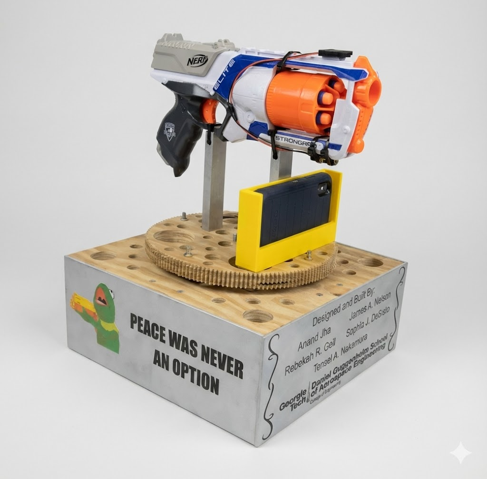
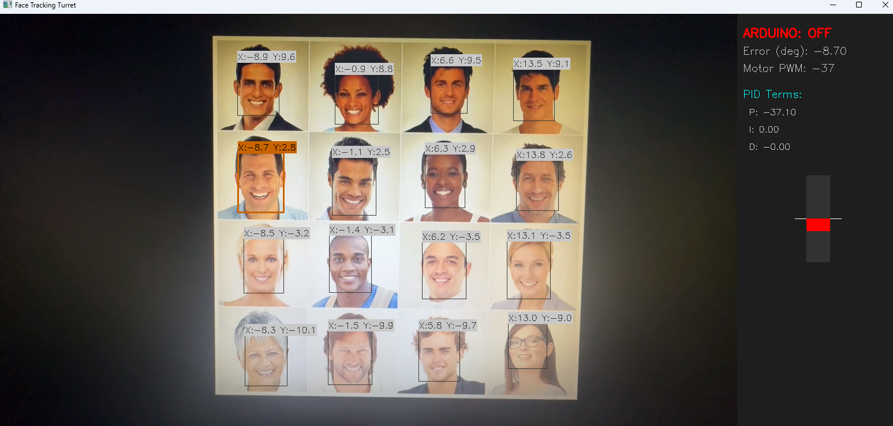

# Face Tracking Turret

A computer vision project that tracks a human face in real-time using a DNN and physically rotates a turret to follow it. The system uses a PID controller to ensure smooth motion and communicates via serial to an Arduino-controlled DC motor.

<p align="center">
  
</p>

<p align="center">
  <table border="0" style="width:100%; border-collapse: collapse;">
    <tr>
      <td style="width: 50%; padding: 10px; text-align: center;">
        
        <br>
        <em>Multiple Faces Detected</em>
      </td>
      <td style="width: 50%; padding: 10px; text-align: center;">
        
        <br>
        <em>Single Target Face</em>
      </td>
    </tr>
  </table>
</p>

## Project Overview

**The Architecture:**
1.  **Input:** A wireless webcam broadcasts a video feed to the host laptop.
2.  **Processing:** A Python script uses OpenCV's DNN module (Deep Neural Network) to detect faces.
3.  **Control Logic:** A PID (Proportional-Integral-Derivative) controller calculates the necessary motor speed based on the face's distance from the center of the frame.
4.  **Hardware Interface:** The calculated speed is sent via USB Serial to an Arduino.
5.  **Actuation:** The Arduino drives an Adafruit Motor Shield to power a DC motor, moving the turret.

## Features

*   **DNN Face Detection:** Uses a Caffe model for robust face detection (more stable than Haar Cascades).
*   **PID Control:** Implements a full PID loop to minimize oscillation and overshoot when tracking.
*   **Active Braking:** Custom Arduino firmware applies reverse polarity pulses to stop the motor instantly, preventing drift.
*   **Heads Up Display (HUD):** Real-time overlay showing PID values, motor power, and tracking status.
*   **Data Logging:** Automatically saves tracking performance data (Error, P, I, D terms) to `.csv` for analysis.
*   **Simulation Mode:** The software runs even without the Arduino connected (using a mock serial interface).

## Hardware Requirements

*   **Computer:** Laptop/Desktop with Python installed.
*   **Camera:** Wireless webcam (or standard USB webcam).
*   **Microcontroller:** Arduino Uno (or compatible).
*   **Motor Driver:** Adafruit Motor Shield v2.
*   **Actuator:** DC Motor (geared preferred for torque).
*   **Power Supply:** External power source for the Motor Shield (USB power is usually insufficient for motors).

## Software Dependencies

### Python
*   Python 3.7+
*   `opencv-python`
*   `pyserial`
*   `numpy`

### Arduino
*   Arduino IDE
*   [Adafruit Motor Shield V2 Library](https://github.com/adafruit/Adafruit_Motor_Shield_V2_Library)

## Installation & Setup

### 1. Python Setup
Clone the repository and install dependencies:
```bash
git clone https://github.com/AnandJha123456789/Face-Tracking-Turret.git
cd face-tracking-turret
pip install -r requirements.txt
```

### 2. Arduino Setup
1.  Open `motor_control_code.ino` in the Arduino IDE.
2.  Install the **Adafruit Motor Shield V2 Library** via the Library Manager.
3.  Connect your Arduino and upload the sketch.

## Usage

1.  Plug in the Arduino via USB.
2.  Ensure your webcam is connected/active.
3.  Check the `CONFIG` section in `face_tracking.py` to match your Serial Port (e.g., `COM3` or `/dev/ttyUSB0`) and Camera ID.
4.  Run the tracker:
    ```bash
    python face_tracking.py
    ```

**Controls:**
*   `q`: Quit the program.
*   `t`: Toggle between showing "Target Only" (Red/Orange) or "All Detected Faces".

## Configuration & Tuning

You can adjust the system performance in the `CONFIG` dictionary at the top of `face_tracking.py`:

*   **PID Tuning:** Modify `ki` and `kd` (Kp is calculated dynamically based on FOV).
*   **Motor Limits:** Adjust `min_motor_speed` if your motor hums but doesn't move, or `max_motor_speed` to limit top speed.
*   **FOV:** Adjust `fov_x_half` if your camera lens is wider or narrower.

## Data Analysis

Every time the script runs, it generates a `tracking_data.csv` file containing:
*   Time
*   Motor Speed
*   Error Angle
*   P, I, D Terms

You can plot this data in Excel or Matplotlib to visualize how well your PID controller is performing.

## License
[MIT License](LICENSE)